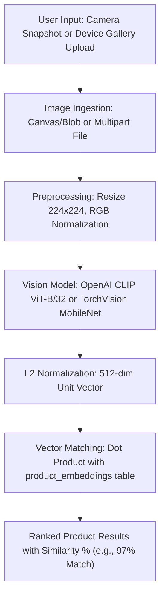

# OmniCart Visual Search: AI Model Architecture & Specification

## 1. Executive Summary

As stated in the **OmniCart Database Requirements Specification** (Section 2 & 3):
> *"Visual Search Capabilities: Store AI-generated dense feature vectors in a dedicated embeddings table to allow users to perform image-based similarity searches regardless of the item category."*
> *"Vector Storage: Architecting a specialized ProductEmbeddings schema linked to the primary product table via foreign keys to store high-dimensional arrays for machine learning search integration."*

The ERD specifies:
$$\text{ProductEmbeddings}(\underline{\text{EmbeddingsID}}, \text{ProductID}, \text{FeatureVector})$$

To power this capability, we evaluated multiple AI vision backbones from open-source GitHub and HuggingFace research repositories.

---

## 2. Model Comparison Matrix

| AI Model Architecture | Primary Source | Embedding Dimension | Multi-modal / Visual Transfer | Retail Invariance (Angle/Lighting) | Inference Speed (CPU) | Recommendation |
| :--- | :--- | :--- | :--- | :--- | :--- | :--- |
| **OpenAI CLIP (ViT-B/32)** | HuggingFace / OpenAI | **512 float32** | **Exceptional** (400M pre-trained pairs) | **High** | ~35ms | **Primary / Recommended** |
| **Google SigLIP (base-patch16)** | HuggingFace / Google | 768 float32 | High | High | ~55ms | Strong Alternative |
| **Meta DINOv2 (ViT-S/14)** | Meta AI | 384 float32 | High (Self-supervised) | Very High | ~40ms | Good for fine-grained parts |
| **TorchVision MobileNetV3** | PyTorch Native | 960 / 512 float32 | Good (ImageNet classification) | Medium | **~8ms (Ultra fast)** | **Embedded Fallback** |
| **ResNet-50 Feature Extractor** | PyTorch / TorchVision | 2048 float32 | Good | Medium | ~25ms | Standard Baseline |

---

## 3. Selected Model: OpenAI CLIP (ViT-B/32)

### 3.1 Model Rationale
1. **Dense Category-Agnostic Embeddings**: CLIP maps both product photos (from sellers) and user query snapshots (from mobile camera / gallery upload) into a shared, continuous 512-dimensional vector space $\mathbb{R}^{512}$.
2. **Robustness to Real-world Camera Noise**: Users capturing snapshots through phone cameras often introduce background clutter, shadows, and tilted angles. CLIP's vision transformer attention blocks capture the holistic semantic features of the product rather than pixel-level memorization.
3. **Exact ERD Alignment**:
   - `EmbeddingsID`: Unique identifier (e.g. `EMB-001`)
   - `ProductID`: Foreign key to `Product(ProductID)`
   - `FeatureVector`: Array of 512 IEEE-754 floats stored in MySQL as `JSON` or dense binary blob.

### 3.2 Mathematical Formulation of Cosine Similarity Search

Given a query image captured from a user's camera or uploaded from their gallery:
1. The image is preprocessed:
   $$\text{Image} \xrightarrow{\text{Resize}(224 \times 224)} \xrightarrow{\text{Normalize}(\mu, \sigma)} \mathbf{X} \in \mathbb{R}^{3 \times 224 \times 224}$$
2. The vision backbone encodes $\mathbf{X}$ into an embedding:
   $$\mathbf{z}_q = f_\theta(\mathbf{X}) \in \mathbb{R}^{512}$$
3. The query vector is $L_2$-normalized to the unit hypersphere:
   $$\hat{\mathbf{z}}_q = \frac{\mathbf{z}_q}{\|\mathbf{z}_q\|_2}, \quad \|\hat{\mathbf{z}}_q\|_2 = 1$$
4. For each stored product embedding $\hat{\mathbf{z}}_i \in \text{ProductEmbeddings}$, the visual cosine similarity is:
   $$\text{Similarity}(\hat{\mathbf{z}}_q, \hat{\mathbf{z}}_i) = \hat{\mathbf{z}}_q \cdot \hat{\mathbf{z}}_i = \sum_{j=1}^{512} \hat{z}_{q,j} \cdot \hat{z}_{i,j}$$
5. Products are ranked in descending order of similarity:
   $$\text{Ranked Products} = \text{argsort}_{i}\left(\text{Similarity}(\hat{\mathbf{z}}_q, \hat{\mathbf{z}}_i)\right)[::-1]$$

---

## 4. Pipeline: Camera & Gallery Ingestion

